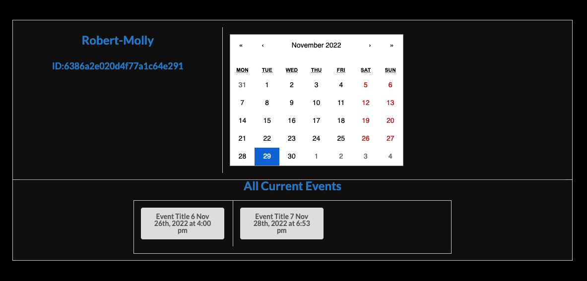
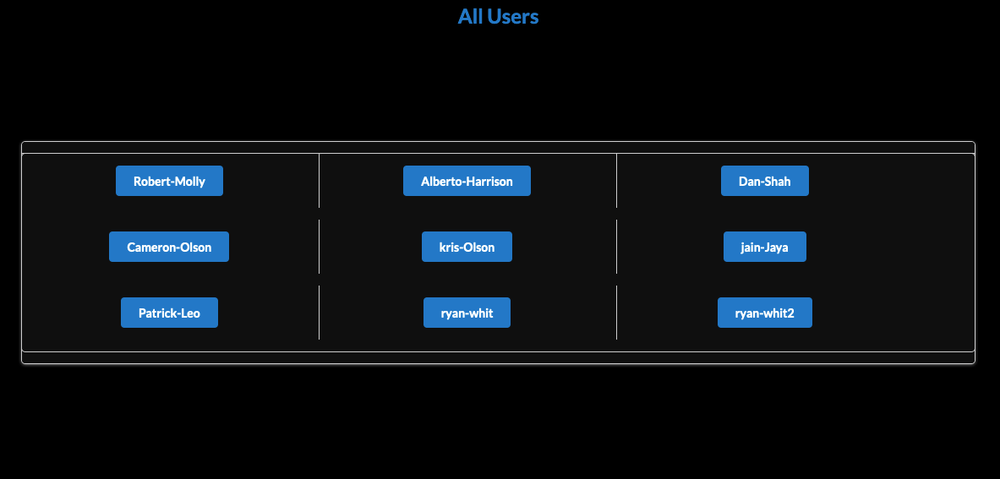
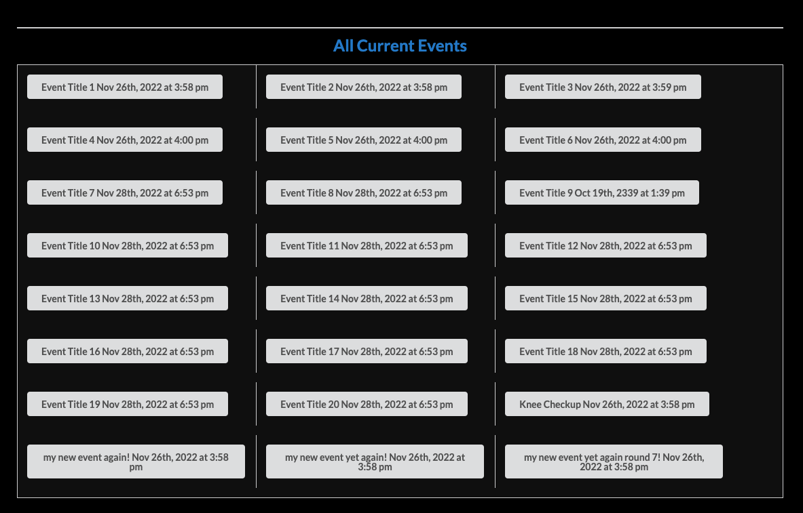
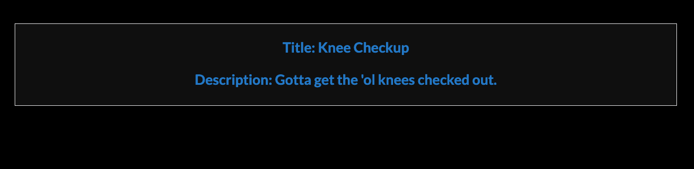

# star-chart

Star chart web app - a scheduling platform for administrators.

Completed as part of the UC Berkeley coding bootcamp.

## Description

As a scheduling administrator for a large organization, I would like to have access to a scheduling app that is scalable and dynamic, with views that can provide specific information about individual users and their associated events.

Appointments are created using an "administrator" view, with queries and mutations provided from `graphql`, and data hosted by MongoDB. Once created, events or appointments can be visualized on a per-user basis.

The Star Chart web app provides scalability via a MongoDB backend, with customized views in a single page application using React, and a dynamic viewing experience through Semantic UI styling.

## Table of Contents

- [Project Links](#project-links)
- [Installation](#installation)
- [Usage](#usage)
- [Contributors](#contributors)
- [Demo](#demo)
- [Tests](#tests)
- [Questions](#questions)

## Project Links

- Deployed application on Heroku: https://star-chart7.herokuapp.com/
- Git repo: https://github.com/TottoMoe/star-chart

## Installation

To install, first clone the repo:

```bash
git clone git@github.com:TottoMoe/star-chart.git
```

Next, navigate to the cloned repo and install both the server and client for development from the command line (assumes `npm` is installed):

```bash
npm install
```

Seed the database so that the app has date to view from the frontend:

```bash
npm run seed
```

The app is now ready for local development.

## Usage

After installation, you can start a local instance of the app by starting the server and client concurrently:

```bash
npm run develop
```

Navigate to the localhost route to view the app using your browser at `http://localhost:3000/`

## Contributors

- [Jenny Deng][1]
- [Ryan Whitmore][2]
- [Jose Reyes][3]
- [Clarence Bungay][4]
- [John Aslani][5]

[1]: https://github.com/TottoMoe
[2]: https://github.com/ryan-whit
[3]: https://github.com/Reyes-Jose
[4]: https://github.com/dalebungay
[5]: https://github.com/johnaslani

## Demo

Once the user is logged in, examples of the application and the associated pages are as follows:

User page - the view for a single user and associated events:



View all users that have logged into the application:



View all events defined in the application:



View a single event for the application:




## Questions

For additional questions, please visit the repo [on GitHub](https://github.com/TottoMoe/star-chart).
